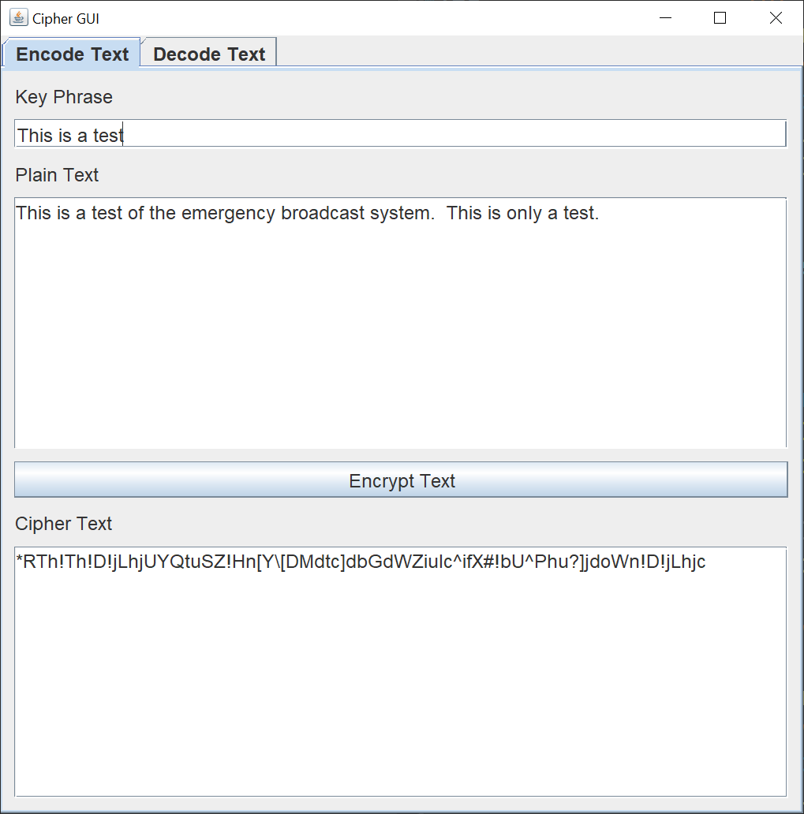
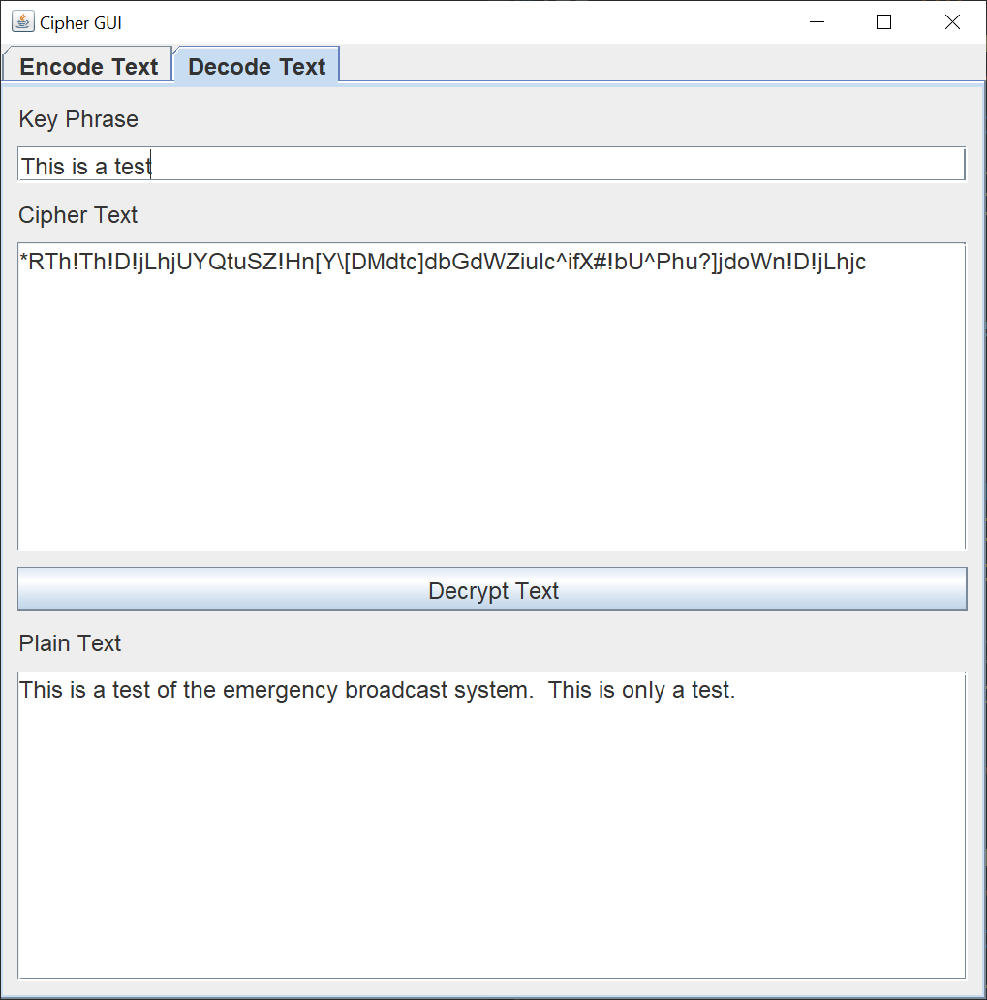

# Cipher GUI

## Introduction

This cipher GUI allows you to encode and decode messages whose ASCII characters fall between 32 decimal and 127 decimal.  If you want to take this code and modify it to work with other Unicode languages, the encrypt and decrypt methods are in the CipherModel class.

This Java Swing GUI uses a JTabbedPane to switch from encoding to decoding.  If you’re not familiar with Java Swing, Oracle has an excellent tutorial to get you started, [Creating a GUI With JFC/Swing](https://docs.oracle.com/javase/tutorial/uiswing/index.html). Skip the Netbeans section.

Here'e what the encoding JPanel looks like.

Here's what the decoding JPanel looks like.

The longer the key phrase, the harder it would be for someone to crack the code.  The encoding concept is simple.  

1.  The first letter of the key phrase is converted to a shift value.  
2.  Depending on which ASCII character is read, a shift value from 1 to 96 is calculated.  
3.  The first letter of the input text is converted to an integer, and the shift value is added.  
4.  If the calculated value is greater than 127, 95 is subtracted from the calculated value.
5.  The calculated value is converted to an ASCII character.

The steps are repeated for each letter in the input text.  If the key phrase is shorter than the text, then the characters of the key phrase are reused as many times as necessary to encode the text.

The decoding concept is similar.

1.  The first letter of the key phrase is converted to a shift value.
2.  Depending on which ASCII character is read, a shift value from 1 to 96 is calculated.
3.  The first letter of the input text is converted to an integer, and the shift value is subtracted. 
4.  If the calculated value is less than 32, 95 is added to the calculated value.
5.  The calculated value is converted to an ASCII character.

The steps are repeated for each letter in the input text.  If the key phrase is shorter than the text, then the characters of the key phrase are reused as many times as necessary to decode the text.

Getting the key phrases to the person that you want to decode your encoded message is tricky.  One way is to agree to use the first headline of a newspaper you both have access to.  Another way is to use two copies of the same book.  The key phrase would be the first sentence of the julian date page.  In other words, today is 13 Feb 2021.  The julian date would be 2021-044.  Today is the 44th day of the year, so the first sentence on page 44 is the key phrase.

## Explanation

Whenever I write a Swing GUI, or most any Java application, I use the [model / view / controller](https://en.wikipedia.org/wiki/Model%E2%80%93view%E2%80%93controller) pattern.  This means, I write the model classes first, then the view classes, then the controller classes.

I wrote one model class, two view classes, and two controller classes.  I made these classes inner classes so I could post the code in one file.  You can separate these classes into separate files if you wish.

### Model

The CipherModel class is a plain Java getter / setter class.  The CipherModel class holds a key phrase, a plain text, and an encoded text.  In addition, the JButton text for the encoding JPanel and decoding JPanel are kept here.  This allows me to create and use two instances of the same JPanel class to create the encoding JPanel and the decoding JPanel.

The encryptText and decryptText methods are included in the CipherModel class, even though they are executed from within a controller class.  I did this because these two methods have easier access to the CipherModel class internal fields.  If you want, you could make these classes part of the controller class.  I find it easier for people to understand the code if I keep like methods together.

### View

I created a JFrame class , CipherGUI, and a JPanel class, CipherPanel.  The CipherGUI run method creates the JFrame.  The CipherGUI createMainPanel method creates the JTabbedPane.  The JTabbedPane holds a encryption JPanel and a decryption JPanel. The CipherPanel createMainPanel method creates the JPanel.

I create two instances of the CipherPanel in the CipherGUI createMainPanel method, one for the encryption JPanel and one for the decription JPanel.  This allows be to reuse the code that creates the JPanel.  I use the GridBagLayout to layout the CipherPanel, because the GridBagLayout allows me to space out the individual Swing components easier.

### Controller

I created a ButtonListener to listen for the button press and either encode or decode the text.

I created an anonymous ChangeListener for the JTabbedPane so I could fill in the key phrase and input text when the user switches tabs.  This allowed me to easily test the encoding and decoding at the same time.  I ran many many tests of the encoding and decoding logic before I got it correct.

## Epilog

If you think cracking this encoding is easy, here's some text for you to decode by hand.  Hint: The paragraph is from one of today's news stories.

w]KHcvgopALdhO[bYgf/WYVdCDKS\fcuZafnWUPoNmJQ_XRd)jIOQo\[pOfueZfqYWVW__jo*ZXfdiZuE`Lbi_Yzf2LUW]e])YZfQoYucSWph^LeSgfUbL_cC_UfSsZWeSfbuXLxfaLS_Zco4ZYPdjddpO[!jRL!KSWFh_^U2_e[_!Xe``KjdK[ffW[XuN]Y1LZLof[\``[t$
